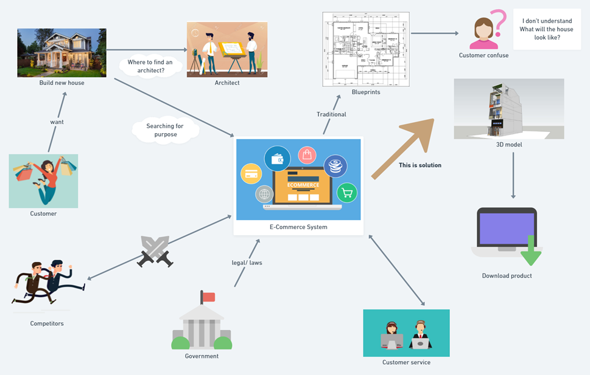
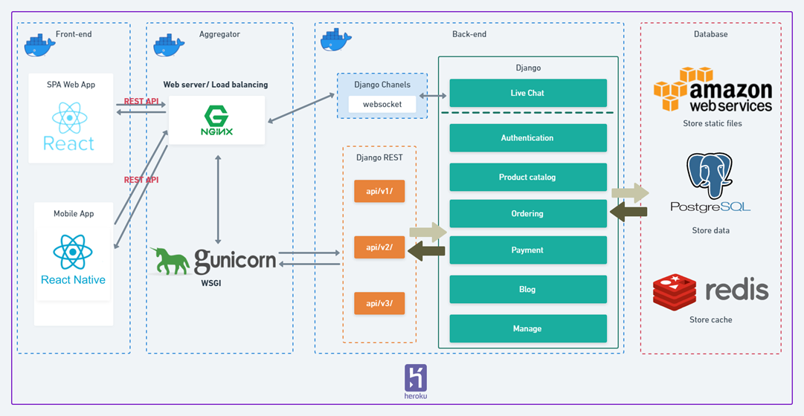
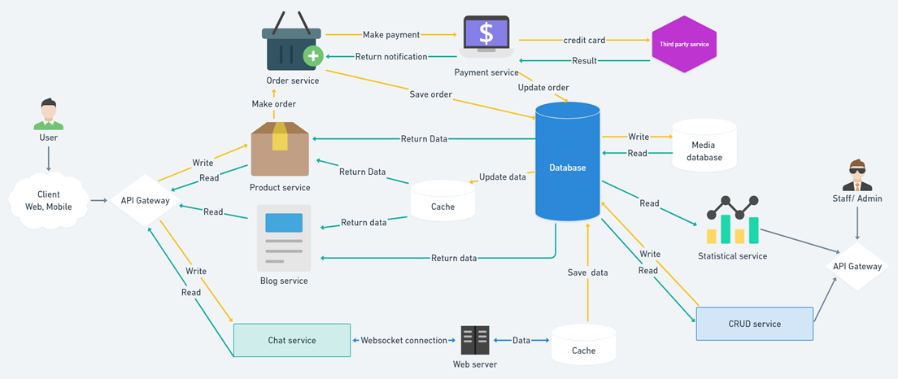

# Future House Project

This project is an e-commerce website dedicated to the architecture sector. The website will sell the design and blueprints files needed for house construction. In addition, this project uses the power and capabilities of the ThreeJS library to create environments and render 3D objects to enhance the customer experience when using the service. The website will also publish articles and news related to the field of architecture for customers to have a deeper insight into this field as well as know the necessary knowledge in house construction

## Authors

- [@Nguyễn Trung Thành](https://www.github.com/thanhwoe)

## Overall Picture

## Architecture

## High Level Design

